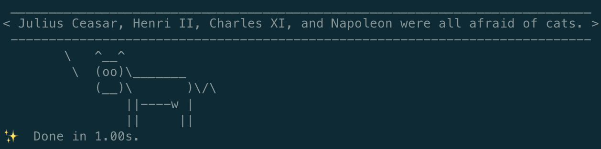

# COWSAY {


<p align="center">
  
</p>

Vamos a crear un programa que genere nombres al hazar dentro de la terminal. La novedad es que vamos a introducir otro gestor de paquetes llamado yarn y un super set de JS llamado typescript.

```bash
yarn init
yarn add typescript eslint
touch .gitignore
tsc --init
yarn eslint --init
```

## Yarn

Se trata del gestor de paquetes de Facebook y para instalarlo debemos seguir las instrucciones de [la página oficial](https://classic.yarnpkg.com/en/docs/getting-started). Para verificar su instalación podemos ejecutar el comando:

```bash
yarn --version
```

> Es recomesable que, si vamos a cambiar de gestor de paquetes, eliminemos todos los ficheros generados de manera automática empleados anteriormente con npm. De esta menera evitaremos conflictos. Nos estamos refieriendo a .parcel-cache, dist, node_modules, etc.

Primero vamos a ejecutar el comando de instalación. A partir de este punto yarn será nuestro gestor de paquetes.

```bash
yarn install
```

## Typescript

Typescript es un lenguaje fuertemente tipado construido por encima de javascript, proporcionando al desarrollador herramientas que permiten desarrollar un código mas robusto, escalable y mantenible.

## Instalar typescript

Podemos instalarlo simplemente corriendo el comando:

```bash
yarn add typescript
```

Eso instalará un programa de terminar (`cli` command line interface) que es el própio compilador typescript. Comprobaremos que se ha instalado correctamente de la siguiente manera:

```bash
tsc -h
```

El comando `tsc` o `TypeScript Compiler` compila ficheros typescript, que normalmente identificamos mediante la extensión `.ts` o `.tsx` a ficheros javascript, identificados por la extensión `.js`.

Mucha gente llama al tipo de compiladores que compilan de un codigo fuente en origen (typescript) a un código de destino (javascript) en lugar de a un archivo binario (como puede ser el caso del compilador del lenguage C++) **transpiladores**, no obstante como ya sabes, en desarrollo de sofware hay muchas terminologias muy similares.

## Configuración del compilador `tsconfig.json`

Para compilar un fichero typescript, antes debemos crear una configuración para el compilador. Esta se guarda en un fichero llamado `tsconfig.json`. Ahi se establecen las reglas de compilación, en que estándar JS queremos el resultado de la compilación, que validaciones tiene que realizar el complador, etc.

Creemos entonces un archivo `tsconfig.json`. Este archivo se puede crear a mano o de manera automática usando el comando:

```bash
tsc --init
```

## FS y AXIOS

Una de las principales ventajas que posee node es que nos permite acceder a funcionalidades útiles de una manera sencilla. En este caso nos vamos a centrar en 2 objetivos:

- Consultar información externa (una API)
- Guardar esa información (a falta de bbdd, valdrá un json)

Como vamos a emplear un archivo typescript, necesitaremos un programa de npm que pueda compilar y ejecutar nuestro código TS:

```bash
yarn add ts-node-dev
```

> package.json

```json
	"scripts": {
		"dev": "ts-node-dev src/app.ts",
		"seed": "ts-node-dev src/seed.ts"
	},
```

> src/app.ts

```ts
console.log('Hello from Typescript');
```

```bash
yarn run dev
```

## Seed file

Si queremos que nuestro programa cuente con información inicial necesitaremos un primer archivo que cargue nuestra BBDD. Como aún no contamos con este sistema, emplearemos un archivo estático JSON del que leerá la información nuestra app.

```bash
touch seed.ts
```

Vamos a instalar 3 paquetes de npm:

- [cowsay](https://www.npmjs.com/package/cowsay)
- [axios](https://www.npmjs.com/package/axios)
- [lodash](https://www.npmjs.com/package/lodash)
- [fs-extra](https://www.npmjs.com/package/fs-extra)

> `Axios` es un cliente HTTP basado en promesas que trabaja tanto para el entorno de node.js como para el navegador.

> `Fs-extra` creación, edición y borrado de archivos en local.

```bash
yarn add cowsay axios lodash @types/lodash fs-extra @types/fs-extra
```

Axios establece una llamada a un servidor mediante el protocolo http. Al ser JS (y, por extensión, TS) un lenguaje de programación monohilo no puede detener su ejecución hasta que el servidor responda por lo que obtendremos un mensaje de `Pending promise`:

> seed.ts

```ts
import cowsay from 'cowsay';
import axios from 'axios';
import _ from 'lodash';
import fs from 'fs-extra';

const getCatsFacts = () => {
	const url: string = 'https://meowfacts.herokuapp.com/';
	const response = axios.get(url);
	console.log(response);
};

getCatsFacts();
```

Para poder trabajar con promesas necesitaremos usar los métodos `then` y `catch`:

> seed.ts

```ts
import cowsay from 'cowsay';
import axios, { AxiosResponse } from 'axios';
import _ from 'lodash';
import fs from 'fs-extra';

const getCatsFacts = () => {
	const url: string = 'https://meowfacts.herokuapp.com/';
	axios
		.get(url)
		.then((response: AxiosResponse) => {
			console.log(response.status);
			console.log(response.data);
		})
		.catch((e: Response) => {
			console.log(e);
			console.log('AXIOS return an error if http error code is > 400');
			console.log(e.status);
		});
};

getCatsFacts();
```

## Programación defensiva

Ahora que somos capaces de hacer una petición a programas externos, vamos a asegurar nuestras funciones con `programación defensiva`. La programación defensiva son el conjunto de prácticas, herramientas y conocimientos que nos ayudan a generar un código más seguro y diferencia un buen programa de otro que no lo es.

> `try...catch`: estos estamentos diferencias nuestro código en 2 bloques. Primero se ejecuta el bloque try y, si se produce alguna excepción, se ejecutará el código en catch. De esta manera nuestro código no quedará bloqueado ya que le ofrecemos una salida y puede continuar.

> seed.ts

```ts
import cowsay from 'cowsay';
import axios, { AxiosResponse } from 'axios';
import _ from 'lodash';
import fs from 'fs-extra';

const getCatsFacts = (facts: number = 6) => {
	const url: string = `https://meowfacts.herokuapp.com/?count=${facts}`;
	try {
		axios
			.get(url)
			.then((response: AxiosResponse) => {
				console.log(response.status);
				console.log(response.data);
				const data = response.data;
				fs.writeJSONSync('catsFacts.json', data);
				const output: string = cowsay.say({
					text: `${facts} cats facts generated`,
				});
				console.log(output);
			})
			.catch((e: Response) => {
				console.log(e);
				console.log('AXIOS return an error if http error code is > 400');
				console.log(e.status);
			});
	} catch (e: any) {
		console.log('AXIOS return an error if http error code is > 400');
		console.log(e.response.status);
	}
};

(async () => {
	getCatsFacts(6);
})();
```

Ahora que ya tenemos data cargada en nuestro proyecto, podemos proceder a generar nuestra app:

> app.ts

```ts
import cowsay from 'cowsay';
import fs from 'fs-extra';
import _ from 'lodash';

try {
	const initialData = fs.readJSONSync('catsFacts.json').data;
	const { length } = initialData;
	const fact = initialData[_.random(length - 1)];
	const output: string = cowsay.say({ text: fact });
	console.log(output);
} catch (error) {
	const output: string = cowsay.say({
		text: 'Cannot find values: Please, run seed file.',
	});
	console.log(output);
}
```

## Tipando nuestro código

Nuestro proyecto funciona. Es capaz de consumir información externa y mostrar, de manera aleatoria, un dato interesante sobre los gatos. No obstante, con typescript podemos hacer que nuestro código sea más seguro y mantenible en el tiempo al emplear tipos y un archivo de configuración:

> src/types/config.type.ts

```ts
type Config = {
	url: string;
	store_file: string;
	cats_facts_threshold: number;
};

export default Config;
```

> src/config.ts

```ts
import Config from './types/config.type';

const configFIle: Config = {
	url: 'https://meowfacts.herokuapp.com/?count=',
	store_file: 'catsFacts.json',
	cats_facts_threshold: 6,
};

export default configFIle;
```

> seed.ts

```ts
import cowsay from 'cowsay';
import axios, { AxiosResponse } from 'axios';
import _ from 'lodash';
import fs from 'fs-extra';
import configFIle from './config';

const getCatsFacts = (facts: number = 6) => {
	const url: string = configFIle.url + facts;
	try {
		axios
			.get(url)
			.then((response: AxiosResponse) => {
				console.log(response.status);
				console.log(response.data);
				const data = response.data;
				fs.writeJSONSync(configFIle.store_file, data);
				const output: string = cowsay.say({
					text: `${facts} cats facts generated`,
				});
				console.log(output);
			})
			.catch((e: Response) => {
				console.log(e);
				console.log('AXIOS return an error if http error code is > 400');
				console.log(e.status);
			});
	} catch (e: any) {
		console.log('AXIOS return an error if http error code is > 400');
		console.log(e.response.status);
	}
};

(async () => {
	getCatsFacts(configFIle.cats_facts_threshold);
})();
```

> No olvides añadir `catsFacts.json` al archivo .gitignore!
